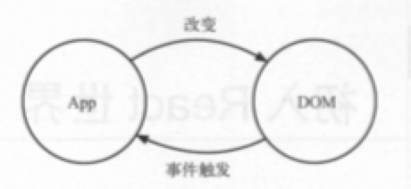
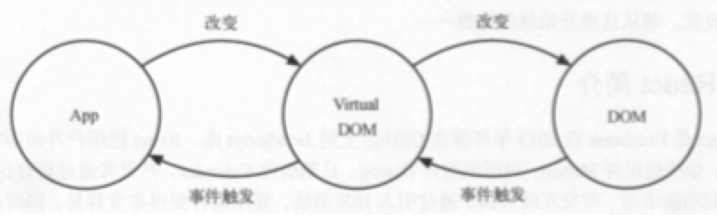
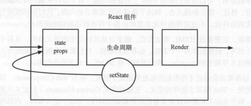

## 初始 React 世界

### React 简介

* React 是一个 JavaScript 库，由 Facebook 在2013年开源。
* React 把用户对象抽象成一个可复用组件。
* 有了组件这层抽象，React把代码和真实渲染目标隔离开来。（因为这个所以可以开发网页和原生移动应用）

#### 专注视图层

* React 包含 View 和 Controller 的库。
* 根据需要搭配 Flux 、Redux、GraphQL/Relay 来处理复杂的业务场景的应用。
* 以 Minimal API Interface （最少API接口）为目标，只提供组件化相关的非常少量的接口。

#### Virtual DOM

**传统页面**



* 更新新页面时，都要手动操作 DOM 来进行更新。
* DOM 操作性能消耗最大，而且这部分代码会让整体项目的代码变得难以维护

**React**



* React 把真实的 DOM 树转换成 JavaScript 对象树，也就是 Virtual DOM。
* 每次数据更新后，重新计算 Virtual DOM，并和上一次生成的 Virtual DOM 做对比，对发生变化的部分做批量更新。
* React 也提供直观的 ```shouldComponentUpdate``` 生命周期函数回调，减少数据变化后不必要的 Virtual DOM 对比国产，以保证性能。
* Virtual DOM 的渲染方式也比传统 DOM 操作好一些，但并不明显，因为对比 DOM 节点也是需要计算资源的。
* 最大的好处是方便与其他平台集成。React 可以根据对应平台输出对应的组件。（Web DOM，Android控件，iOS控件）

#### 函数式编程

* React 能充分利用很多函数方式去减少冗余的代码。
* 由于它本身就是简单函数，所以易于测，所以便于测试。

### JSX 语法

#### JSX 的由来

React 是通过创建和更新虚拟元素来管理整个 Virtual DOM 的，但是虚拟元素仅仅通过 JavaScript 来描述会变得异常复杂，所以才有 JSX。

虚拟元素可以理解为真实元素的对应，它的构建与更新都是在内存中完成的，并不会真正渲染到 DOM 中去。

在 React 中创建虚拟虚拟元素可以分为两类：

* DOM 元素
* 组件元素

分别对应：

* 原生 DOM 元素
* 自定义元素

例如一个按钮

```
<button class="btn btn-blue">
	<em>Confirm<em>
</button> 
```

**DOM 元素**

这些HTML元素可以被 JavaScript 转换为纯粹的 JSON 对象。我们可以通过 JSON 对象来描述 DOM 元素。

```
{
	type: 'button',
	props: {
		className: 'btn btn-blue',
		children: {
			type: 'em',
			props: {
				children: 'Confirm'
			}
		}
	}
}
```

**组件对象**

我们可以封装上述 button 元素，得到一个公共方法。

```
const button = ({color, text}) => {
    return {
        type: 'button',
        props: {
            className: 'btn btn-${color}',
            children: {
                type: 'em',
                props: {
                    children: text
                }
            }
        }
    }
}
```

其实这个 button 方法也可以作为元素存在，方法名对应元素类型，参数对应 DOM 元素属性，它就具备了元素的两大必要条件，这样构建的元素就是自定义类型元素，或称组件元素。

用 JSON 结构来描述它：

```
{
	type: Button,
	props: {
		color: 'blue',
		children: 'confirm'
	}
}
```

这样我们就可以一直嵌套封装组件元素，但是就是这样，代码会变得非常难以阅读。

* JSX 将 HTML 语法直接加入 JavaScript 代码中，再通过翻译器转换到纯 JavaScript 后由浏览器执行。
* 在实际开发中，JSX 在产品打包阶段都已经编译成纯 JavaScript。
* 现在采用 Babel 的 JSX 编译器实现解析 JSX 语法（以前React为JSX解析开发了一套编译器 JSTransform）
* Babel 作为专门的 JavaScript 语法编译工具，提供了更为强大的功能，达到了“一处配置，统一运行”的目的。


使用 JSX 语法来描述组件元素

```
const button = () => (
	<button class="btn btn-blue">
		<em>Confirm<em>
	</button> 
)
```

组件通过 Babel 转译成 React 可执行的代码：

```
var button = button() {
	return React.createElement(
		'button',
		{className: 'btn btn-blue'},
		React.createElement(
			'em',
			null,
			'Confirm'
		)
	)
}
```

#### JSX 基本语法

JSX 的官方定义是类 XML 语法的 ECMAScripte 拓展。

```
const List = () => {
	<div>
		<Title>This is Title</Title>
		<ul>
			<li>list item</li>
			<li>list item</li>
			<li>list item</li>
		</ul>
	</div>
}
```

**XML 基本语法**

* 定义标签时，只允许被一个标签包裹。
* 标签一定要闭合。


**元素类型**

* 标签以小写字母开头对应 DOM 元素。比如 List 组件中的 `<div>` 标签会生成 DOM 元素。
* 标签以大写字母开头对应组件元素。比如 List 组件中的 `<Title>` 会生成组件元素。
* JSX 还可以通过命名空间的方式使用组件元素，以解决组件相同名称冲突的问题，或是对一组组件进行归类。

```
const App = () => (
	{/*节点注释*/}
	<MUI.RaiseButton 
	/*
		多行注释
	*/
	label="Default" />
);
```

**元素属性**

元素除了标签之外，另一个组成部分就是标签的属性。

不论是 DOM 元素还是组件元素，它们都有属性。不同的是：

* DOM 元素的属性是标准规范属性，但有两个例外 class 和 for ，因为在 JavaScript 中这两个单词都是关键词
	* class 属性改 className
	* for 属性改为 htmlFor
* 组件元素属性是完全自定义的属性，也可以理解为实现组件所需要的参数。

*Boolean 属性*

省略 Boolean 属性会导致 JSX 认为 bool 值设为 true。这常用于表单元素中，比如 disabled、required、checked 和 readOnly 等。

```
<Checkbox checked={true} /> 
//可以简写 
<Checkbox checked />
```

*展开属性*

例如

```
const component = <Component name={name} value={value} />
```

不能这样设置属性。

```
const component = <Componnet />;
component.props.name = name;
component.props.value = value;
```

React 不能帮你检查属性类型（propTypes）。即使组件属性类型有错误，也不能得到清晰的错误提示。

可以这样设置

```
const data = {name: 'foo', value: 'bar'};
const component = <Componnet {...data}/>
```

*自定义HTML属性*

如果在 JSX 中往DOM 元素中传入自定义属性，React 是不会渲染的：

```
<div x="xxx" />
```

如果要使用HTML 自定义属性，要使用 `data-` 前缀，这与 HTML 标准一致：

```
<div data-x="xxx" />
```

渲染出来的效果跟这个一致。

在自定义标签中任意的属性都是被支持的：

```
<x-my-component custom-attr="foo" />
```

以 `aria-` 开头的网络无障碍属性也同样可以正常使用：

```
<div aria-hidden="true" />
```

**JavaScript 属性表达式**

属性值要使用表达式，只要用 `{}` 替换 `""` 即可

*HTML转义*

React 会将所有要显示到 DOM 的字符串转义，防止 XSS。所以，如果 JSX 中含有转义后的实体字符，比如 `&copy` ，则到最后DOM不会正确显示，因为 React 自动把 `&copy` 中的特殊字符转义了。

有几种解决方法

* 直接使用UTF-8字符。
* 使用字符对应的 Unicode编码查询编码。
* 使用数组组装 `<div>{['cc', '<span>&copy<span>', '2019']}</div>`
* 直接插入原始的 HTML

此外，React 提供了 dangerouslySetInnerHTML 属性。正如其名，它的作用就是避免 React 转义字符，所以需要在确定必要的时候使用它：

```
<div dangerouslySetInnerHTML={{__html: 'cc &copy; 2019'}} />
```

### React 组件

#### React 组件得构成



* React 组件基本由 属性（props）、状态（state）以及生命周期方法组成。
* React 组件即为组件元素，组件元素被描述成纯粹的JSON 对象，意味着可以使用方法或类来构建。
* 一旦接收到的参数或自身状态有所改变，React 组件就会执行相应的生命周期方法，最后渲染。

React 提供了3种不同的方法构建 React 组件：

* React.createClass
* ES6 classes
* 无状态函数（stateless function）

**React.createClass**

* 最传统、也是兼容性最好的构建组件方法
* 在 0.14 版本发布之前，官方指定的方法

```
const Button = React.createClass({
	getDefaultProps() {
		return {
			color: 'blue',
			text: 'confirm'
		};
	},
	render() {
		const { color, text } = this.props;
		
	}
})
```


