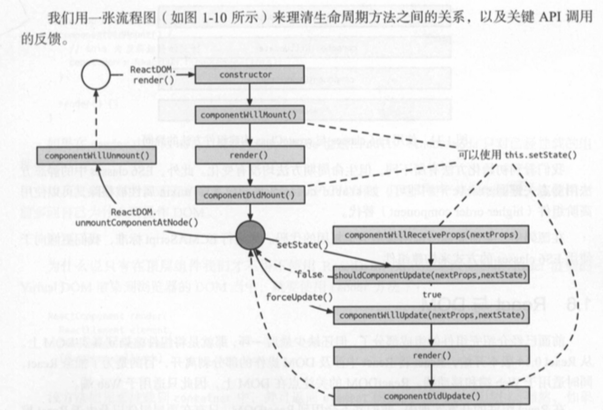

## 初始 React 世界

### React 简介

* React 是一个 JavaScript 库，由 Facebook 在2013年开源。
* React 把用户对象抽象成一个可复用组件。
* 有了组件这层抽象，React把代码和真实渲染目标隔离开来。（因为这个所以可以开发网页和原生移动应用）

#### 专注视图层

* React 包含 View 和 Controller 的库。
* 根据需要搭配 Flux 、Redux、GraphQL/Relay 来处理复杂的业务场景的应用。
* 以 Minimal API Interface （最少API接口）为目标，只提供组件化相关的非常少量的接口。

#### Virtual DOM

**传统页面**


* 更新新页面时，都要手动操作 DOM 来进行更新。
* DOM 操作性能消耗最大，而且这部分代码会让整体项目的代码变得难以维护

**React**


* React 把真实的 DOM 树转换成 JavaScript 对象树，也就是 Virtual DOM。
* 每次数据更新后，重新计算 Virtual DOM，并和上一次生成的 Virtual DOM 做对比，对发生变化的部分做批量更新。
* React 也提供直观的 ```shouldComponentUpdate``` 生命周期函数回调，减少数据变化后不必要的 Virtual DOM 对比国产，以保证性能。
* Virtual DOM 的渲染方式也比传统 DOM 操作好一些，但并不明显，因为对比 DOM 节点也是需要计算资源的。
* 最大的好处是方便与其他平台集成。React 可以根据对应平台输出对应的组件。（Web DOM，Android控件，iOS控件）

#### 函数式编程

* React 能充分利用很多函数方式去减少冗余的代码。
* 由于它本身就是简单函数，所以易于测，所以便于测试。

### JSX 语法

#### JSX 的由来

React 是通过创建和更新虚拟元素来管理整个 Virtual DOM 的，但是虚拟元素仅仅通过 JavaScript 来描述会变得异常复杂，所以才有 JSX。

虚拟元素可以理解为真实元素的对应，它的构建与更新都是在内存中完成的，并不会真正渲染到 DOM 中去。

在 React 中创建虚拟虚拟元素可以分为两类：

* DOM 元素
* 组件元素

分别对应：

* 原生 DOM 元素
* 自定义元素

例如一个按钮

```
<button class="btn btn-blue">
	<em>Confirm<em>
</button> 
```

**DOM 元素**

这些HTML元素可以被 JavaScript 转换为纯粹的 JSON 对象。我们可以通过 JSON 对象来描述 DOM 元素。

```
{
	type: 'button',
	props: {
		className: 'btn btn-blue',
		children: {
			type: 'em',
			props: {
				children: 'Confirm'
			}
		}
	}
}
```

**组件对象**

我们可以封装上述 button 元素，得到一个公共方法。

```
const button = ({color, text}) => {
    return {
        type: 'button',
        props: {
            className: 'btn btn-${color}',
            children: {
                type: 'em',
                props: {
                    children: text
                }
            }
        }
    }
}
```

其实这个 button 方法也可以作为元素存在，方法名对应元素类型，参数对应 DOM 元素属性，它就具备了元素的两大必要条件，这样构建的元素就是自定义类型元素，或称组件元素。

用 JSON 结构来描述它：

```
{
	type: Button,
	props: {
		color: 'blue',
		children: 'confirm'
	}
}
```

这样我们就可以一直嵌套封装组件元素，但是就是这样，代码会变得非常难以阅读。

* JSX 将 HTML 语法直接加入 JavaScript 代码中，再通过翻译器转换到纯 JavaScript 后由浏览器执行。
* 在实际开发中，JSX 在产品打包阶段都已经编译成纯 JavaScript。
* 现在采用 Babel 的 JSX 编译器实现解析 JSX 语法（以前React为JSX解析开发了一套编译器 JSTransform）
* Babel 作为专门的 JavaScript 语法编译工具，提供了更为强大的功能，达到了“一处配置，统一运行”的目的。


使用 JSX 语法来描述组件元素

```
const button = () => (
	<button class="btn btn-blue">
		<em>Confirm<em>
	</button> 
)
```

组件通过 Babel 转译成 React 可执行的代码：

```
var button = button() {
	return React.createElement(
		'button',
		{className: 'btn btn-blue'},
		React.createElement(
			'em',
			null,
			'Confirm'
		)
	)
}
```

#### JSX 基本语法

JSX 的官方定义是类 XML 语法的 ECMAScripte 拓展。

```
const List = () => {
	<div>
		<Title>This is Title</Title>
		<ul>
			<li>list item</li>
			<li>list item</li>
			<li>list item</li>
		</ul>
	</div>
}
```

**XML 基本语法**

* 定义标签时，只允许被一个标签包裹。
* 标签一定要闭合。


**元素类型**

* 标签以小写字母开头对应 DOM 元素。比如 List 组件中的 `<div>` 标签会生成 DOM 元素。
* 标签以大写字母开头对应组件元素。比如 List 组件中的 `<Title>` 会生成组件元素。
* JSX 还可以通过命名空间的方式使用组件元素，以解决组件相同名称冲突的问题，或是对一组组件进行归类。

```
const App = () => (
	{/*节点注释*/}
	<MUI.RaiseButton 
	/*
		多行注释
	*/
	label="Default" />
);
```

**元素属性**

元素除了标签之外，另一个组成部分就是标签的属性。

不论是 DOM 元素还是组件元素，它们都有属性。不同的是：

* DOM 元素的属性是标准规范属性，但有两个例外 class 和 for ，因为在 JavaScript 中这两个单词都是关键词
	* class 属性改 className
	* for 属性改为 htmlFor
* 组件元素属性是完全自定义的属性，也可以理解为实现组件所需要的参数。

*Boolean 属性*

省略 Boolean 属性会导致 JSX 认为 bool 值设为 true。这常用于表单元素中，比如 disabled、required、checked 和 readOnly 等。

```
<Checkbox checked={true} /> 
//可以简写 
<Checkbox checked />
```

*展开属性*

例如

```
const component = <Component name={name} value={value} />
```

不能这样设置属性。

```
const component = <Componnet />;
component.props.name = name;
component.props.value = value;
```

React 不能帮你检查属性类型（propTypes）。即使组件属性类型有错误，也不能得到清晰的错误提示。

可以这样设置

```
const data = {name: 'foo', value: 'bar'};
const component = <Componnet {...data}/>
```

*自定义HTML属性*

如果在 JSX 中往DOM 元素中传入自定义属性，React 是不会渲染的：

```
<div x="xxx" />
```

如果要使用HTML 自定义属性，要使用 `data-` 前缀，这与 HTML 标准一致：

```
<div data-x="xxx" />
```

渲染出来的效果跟这个一致。

在自定义标签中任意的属性都是被支持的：

```
<x-my-component custom-attr="foo" />
```

以 `aria-` 开头的网络无障碍属性也同样可以正常使用：

```
<div aria-hidden="true" />
```

**JavaScript 属性表达式**

属性值要使用表达式，只要用 `{}` 替换 `""` 即可

*HTML转义*

React 会将所有要显示到 DOM 的字符串转义，防止 XSS。所以，如果 JSX 中含有转义后的实体字符，比如 `&copy` ，则到最后DOM不会正确显示，因为 React 自动把 `&copy` 中的特殊字符转义了。

有几种解决方法

* 直接使用UTF-8字符。
* 使用字符对应的 Unicode编码查询编码。
* 使用数组组装 `<div>{['cc', '<span>&copy<span>', '2019']}</div>`
* 直接插入原始的 HTML

此外，React 提供了 dangerouslySetInnerHTML 属性。正如其名，它的作用就是避免 React 转义字符，所以需要在确定必要的时候使用它：

```
<div dangerouslySetInnerHTML={{__html: 'cc &copy; 2019'}} />
```

### React 组件

#### React 组件得构成


* React 组件基本由 属性（props）、状态（state）以及生命周期方法组成。
* React 组件即为组件元素，组件元素被描述成纯粹的JSON 对象，意味着可以使用方法或类来构建。
* 一旦接收到的参数或自身状态有所改变，React 组件就会执行相应的生命周期方法，最后渲染。

React 提供了3种不同的方法构建 React 组件：

* React.createClass
* ES6 classes
* 无状态函数（stateless function）

**React.createClass**

* 最传统、也是兼容性最好的构建组件方法
* 在 0.14 版本发布之前，官方指定的方法。但是现在测试已经不能使用了。

```
const Button = React.createClass({
	getDefaultProps() {
		return {
			color: 'blue',
			text: 'confirm'
		};
	},
	render() {
		const { color, text } = this.props;
		
		return(
			<button className={'btn btn-${color}'}>
				<em>{text}</em>
			</button>
    )
	}
})
```

* 后面的版本需要这样使用
* 引用 `npm install create-react-class`

```
import createReactClass from 'create-react-class';

const Button = createReactClass({
  getDefaultProps() {
		return {
			color: 'blue',
			text: 'confirm'
		};
	},
	render() {
		const { color, text } = this.props;
		
		return(
			<button className={'btn btn-${color}'}>
				<em>{text}</em>
			</button>
    	)
	}
})

export default Button;

```

当另一个组件需要调用 Button 组件时，只用写成 `<Button />`，就可以被解析成 `React.createElement(button)` 方法来创建 Button 实例。

**ES6 classes**

ES6 classes 的写法是通过 ES6 标准的类语法的方式来构建：

```
import React, { Component } from 'react';

class Button extends Component {
	constructor(props) {
		super(props);
	}
	
	static defaultProps = {
		color: 'blue',
		text: 'Confirm'
	};
	
	render() {
		const { color, text } = this.props;
		
		return(
			<button className={'btn btn-${color}'}>
				<em>{text}</em>
			</button>
    	)
	}
}
```


**无状态函数**

```
function Button({ color = 'blue', text = 'Confirm'}) {
	return (
		<button className={'btn btn-${color}'}>
			<em>{text}</em>
		</button>
	)
}
```

* 不存在 state，也没有声明周期函数。


### 数据流

在 React 中，数据是自顶向下单向流动的，即从父组件到子组件。

* 顶层组件初始化 props，那么 React 会向下遍历整棵组件树，重新尝试渲染所有相关的子组件。
* 而 state 只关心每个组件自己内部的状态，这些状态只能在组件内改变。
* 把组件看出一个函数，那么它接收了 props 作为参数，内部由 state 作为函数内部参数，返回一个 Virtual DOM 的实现。

#### state

* State是一个组件的UI数据模型，是组件渲染时的数据依据。
* 通过在构造函数（constructor）中初始化 state，这也是唯一一个可以可以直接使用 `this.state={xxx:xxx}`的方式修改state的情况。
* 在其他时候我们需要通过 `setState` 这个异步方法进行修改，在一个生命周期内的所有 `setState` 方法会合并操作。

#### props

* props经常被用作渲染组件和初始化状态，当一个组件被实例化之后，它的props是只读的，不可改变的。如果props在渲染过程中可以被改变，会导致这个组件显示的形态变得不可预测。只有通过父组件重新渲染的方式才可以把新的props传入组件中。
* 要渲染一个对props加工后的值，最简单的办法就是使用局部变量或直接在JSX中计算结果。


**子组件 prop**

* 在 React 中有一个重要且内置的 prop —— children，它代表组件的子组件集合。
* React.Children 提供了处理 this.props.children 这个不透明数据结构的工具。
* React.Children.map 
	* `React.Children.map(children, function[(thisArg)])`在包含在 children 里的每个直接孩子上调用一个函数，并且this 设置为 thisArg 。
	* 如果 children 是一个数组它将被遍历，函数将被调用为每个数组中的孩子。如果 children 是 null 或 undefined ，这个方法将返回 null 或 undefined 而不是一个数组。
* React.Children.only
	* `React.Children.only(this.props.children)`
	* 验证children只有唯一一个孩子（React元素）并返回它。否则这个方法扔抛出一个错误。这个错误会导致页面显示失败。
* React.Children.count
	* 返回 children 中的组件总数，等于传给 map 或 forEach 的回调函数被调用的次数。
* React.Children.forEach
 * 类似 React.Children.map() ，但是不返回数组。
 

需要注意的是这里children是写在使用这个组件的地方，组件标签内包含的组件，不是这个组件中 render 函数返回的里面包含的组件。如下面 `<Item>` 的子组件是 `<h1>11111</h1>`、`<p>2222</p>`和`something`，而不是它render函数内包含的组件。

```
<Item>
  <h1>11111</h1>
  <p>2222</p>
  something
</Item>
```

```
import React, { Component } from 'react';

class Item extends Component {
	constructor(props) {
        super(props);
	}
    renderChild() {
        const child = React.Children.map(this.props.children,(children)=>{
              return (<div>{children.type ? children.type: children}</div>)
          })
        return child
    }

	render() {
		return(
			<div>
                {this.renderChild()}
			</div>
    	)
	}
}

export default Item;

// 显示
/*
h1
p
something
*/
```


**组件 props**

可以将子组件作为props传入到另一个组件中

```
<Button item={<div>hello,world</div>}/>
```

```
class Button extends Component {
	constructor(props) {
		super(props);
	}
	render() {
		
		return(
			<div className="item">
                {this.props.item}
            </div>
    	)
	}
}
export default Button;
```

**用function prop 与父组件通信**

```
class App extends Component {
	constructor(props) {
		super(props);
	}
	handleClick() {
		console.log('handleClick')
	}
	render() {
		
		return(
			<div>
				<Button onClick={this.handleClick}></Button>
			</div>
    	)
	}
}
```


```
class Button extends Component {
	constructor(props) {
		super(props);
		this.buttonClick = this.buttonClick.bind(this)
	}
	buttonClick() {
		this.props.onClick()
	}
	render() {
		
		return(
			<div>
				<div onClick={this.buttonClick}>handleClick</div>
				<div onClick={()=>{this.props.onClick()}}>handleClick</div>
			</div>
    	)
	}
}
export default Button;
```

**propTypes**

* propTypes 用于规范 props 的类型与必需的状态。
* 如果定义了 propTypes，那么在开发环境下，就会对组件的 props 值的类型做检查，如果传入的 props 不能与之匹配，React 将会实时在控制台里报 warning。
* 生成环境不会检查。


新版本需要安装 prop-types

```
import PropTypes from 'prop-types'

// 这个写在写在class里面
// static propTypes = {
// 	onClick: PropTypes.func
// }

// 这个写在class外面，跟上面的效果一样
Button.propTypes = {
	onClick: PropTypes.func
}
```

老版本

```
Button.propTypes = {
	onClick: React.PropTypes.func
}
```

### 生命周期

* React 组件的生命周期可以分为挂载、渲染和卸载这几个阶段。

#### 组件的挂载

挂载过程会先后执行

* componentWillMount
* render
* componentDidMount

这些方法只会在初始化的时候执行一次。

#### 组件卸载

组件卸载之前会执行一个方法，通常用于执行一些清理方法，如事件回收或是清除定时器。

* componentWillUnmount

#### 组件更新

更新过程指的是父组件向下传递 props 或组件自身执行 setState 方法时发生的一系列更新动作。

当我们在shouldComponentUpdate方法返回false时，后面的方法都不会被执行，表示组件不需要更新。

* componentWillReceiveProps（如果是由父组件更新props而更新的话）
* shouldComponentUpdate
* componentWillUpdate
* render
* componentDidUpdate

需要注意的几个地方

* 默认情况下，React会渲染所有的节点，因为shouldComponentUpdate默认返回true。正确的组件渲染从另一个意义上说，也是性能优化的手段之一。
* 无状态组件是没有生命周期的，渲染该类组件是，每次都会重新渲染。
* componentWillUpdate 和 componentDidUpdate，他们分别代表更新过程中渲染前后的时刻，componentWillUpdate 方法提供需要更新的 props 和 state，而 componentWillUpdate 提供更新前的 props 和 state。
* 不能在 componentDidUpdate 中执行 setState。
* componentWillReceiveProps 方法中调用 setState 是不会二次渲染的。

整体流程图




### React 与 DOM

从 React 0.14 版本开始，React 将 React 中涉及 DOM 操作的部分剥离开，目的是为了抽象 React，同时适用于 Web 端和移动端。ReactDOM 的关注点在 DOM上，因此只适用于 Web端。

在 React 组件开发实现中，我们并不会用到 ReactDOM，只有在顶层组件以及由于 React 模型所限而不得不操作DOM的时候，才会使用它。

#### ReactDOM

ReactDOM 中的API 非常少，只有 findDOMNode、unmountComponentAtNode 和 render。

**findDOMNode**

在之前的组件介绍的组件得生命周期中，DOM 真正被添加到 HTML 中的生命周期方法是 componentDidMount 和 componentDidUpdate 方法。在这两个方法中，我们可以获取真正的DOM元素。React 提供的获取DOM元素的方法有两种，其中一种就是ReactDOM提供的 findDOMNode。

```
import ReactDOM from 'react-dom'

componentDidMount() {
	const dom = ReactDOM.findDOMNode(this)
}
```

findDOMNode 只对已经挂载的组件有效。

**render**

```
ReactDOM.render(element, container[, callback])
```


