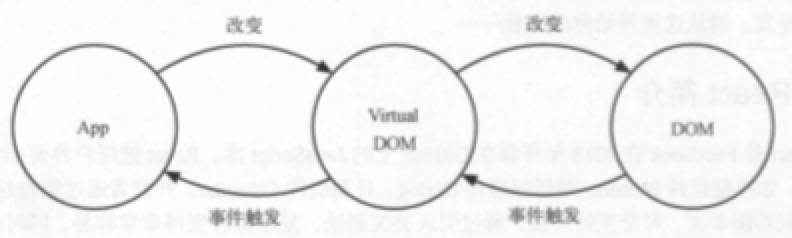

## 初始 React 世界

### React 简介

* React 是一个 JavaScript 库，由 Facebook 在2013年开源。
* React 把用户对象抽象成一个可复用组件。
* 有了组件这层抽象，React把代码和真实渲染目标隔离开来。（因为这个所以可以开发网页和原生移动应用）

#### 专注视图层

* React 包含 View 和 Controller 的库。
* 根据需要搭配 Flux 、Redux、GraphQL/Relay 来处理复杂的业务场景的应用。
* 以 Minimal API Interface （最少API接口）为目标，只提供组件化相关的非常少量的接口。

#### Virtual DOM

**传统页面**

* 更新新页面时，都要手动操作 DOM 来进行更新。
* DOM 操作性能消耗最大，而且这部分代码会让整体项目的代码变得难以维护

**React**

* React 把真实的 DOM 树转换成

